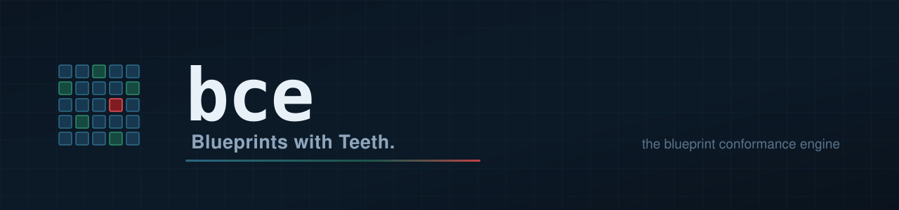

<p align="center">
  
</p>

# bce — the blueprint conformance engine

> **Blueprints with Teeth.** Agents write fast. Something has to stay picky.

**[Author a contract, catch a real violation, and go green on your own repo — in under 10 seconds.](tests/first-win-matrix.test.ts)**

*The repository test suite times four local fixture journeys and enforces the ten-second ceiling.
This is an internal regression measurement, not an independent performance benchmark.*

<!-- award-slot: RESERVED, and deliberately inert.
     A chip goes live ONLY when the thing is actually won, in a PR that links the award —
     never as a decoration that rides along with an unrelated change. The promise
     `readme/award-slots` in scripts/launch-readiness-check.mjs refuses any chip that appears
     outside this comment, so activation cannot happen by accident.
<p align="center">
  <a href="AWARD-URL"></a>
</p>
-->

[](https://github.com/blueprint-conformance/bce/actions/workflows/self-gate.yml)
[](https://github.com/blueprint-conformance/bce/actions/workflows/ci.yml)

<p align="center">
  
  
  
  =22">
  
</p>

**[See it](#see-it) · [Try it](#try-it) · [Onboard the full stack](docs/onboarding.md) · [Learn](#what-is-measured-not-asserted) · [Docs](#docs-and-spec) · [License](#license)**

Agents write code faster than anyone can review it. **bce** is the merge gate that keeps what
they write true to your architecture. You author a **blueprint** — a small, versioned JSON
contract for a repository — and bce measures the code against it: a deterministic conformance
score, a fail-closed verdict, and hash-chained evidence anyone can re-derive offline.

## See it

One forbidden import, two ways the day can go:

| Agent PR, no gate | Same PR, `bce` gate |
|---|---|
| The agent adds `import axios` to a plugin. It compiles, the tests pass, CI goes green. | The gate reads the same tree and refuses — `no-direct-http-client`, score 60, exit code 1. |
| Review sees a 400-line diff and a green tick. The forbidden edge is one line of it. | The refusal names the edge: `extension:greeting.plugin -> axios`, at `src/greeting.plugin.ts#L16`. |
| It merges. The rule now exists only in whoever remembers it. | It blocks, and prints both ways out: fix the code, or amend the rule in the blueprint by PR. |
| You find out months later, when the thing the rule protected breaks. | You find out in about a second, on the PR that introduced it. |

A gate that cannot go red is not a gate. Here is this one refusing a real forbidden import,
then passing the corrected tree — one contract, two trees, real exit codes:

<p align="center">
  
</p>

```console
$ bce gate --repo drift --blueprint-dir blueprint --extractor ast --all
::error::blueprint no-direct-http-client@0.1.0 FAILED — score 60: 1 NEW violation(s). 1 constraint(s) evaluated; 1 violation(s); score 60
::error::  no-direct-http-client (critical): 1 violation(s)
::error::    - [no-direct-http-client/critical] extension:greeting.plugin
        observed: forbidden edge extension:greeting.plugin -> axios is present
        expected: no axios edge
        at:       src/greeting.plugin.ts#L16
      fix: change the code to satisfy 'no-direct-http-client'  |  amend: if the rule is wrong, edit/remove 'no-direct-http-client' in the blueprint via PR
bce gate [enforced]: 1/1 blueprint(s) evaluated, 1 failing.
$ echo $?
1

$ bce gate --repo clean --blueprint-dir blueprint --extractor ast
  ✓ no-direct-http-client@0.1.0 — score 100 (pass)
bce gate [enforced]: 1/1 blueprint(s) evaluated, 0 failing.
$ echo $?
0
```

Both runs are re-executed on every push and asserted byte-for-byte against this page by
[`tests/root-readme-proof.test.ts`](tests/root-readme-proof.test.ts) — which also reads the
transcript back out of the animation above, so neither the block nor the image can go stale
without turning a check red. Regenerate them with
[`scripts/hero-demo-record.mjs`](scripts/hero-demo-record.mjs) and
[`scripts/hero-cast-svg.mjs`](scripts/hero-cast-svg.mjs).

## Try it

Install the exact verified release on Node 22 or newer:

```bash
npm install --save-dev --save-exact bce-engine@0.1.1
npx --no-install bce demo
```

The package was published through npm Trusted Publishing with
[provenance](https://www.npmjs.com/package/bce-engine/v/0.1.1), after the release workflow reran
the full suite, corpus/recall proof, self-gate, leakage gate, and RED/GREEN discriminating pair.

`bce demo` runs an offline packaged GREEN/RED discrimination proof with no repository setup.
`npm run test:onboarding` creates clean external consumers and proves the packed and immutable-Git
install paths, both binaries, author/onboard, advisory RED, fix/GREEN, evidence verification, and all
six MCP tools. CI and the release gate rerun that black-box journey.
The full walkthrough — RED, the fix, GREEN, and what each verdict means — is
[docs/quickstart.md](docs/quickstart.md) · [examples/quickstart](examples/quickstart). A second
worked example, on a config surface rather than code, is
[examples/config-guard](examples/config-guard).

Starting from your own repository instead of a fixture? [docs/first-win.md](docs/first-win.md)
covers four starting shapes — empty repo, plain JS, TypeScript, monorepo — each a real
`bce author` → RED → fix → GREEN loop, and each one wall-clock measured on every push by
[`tests/first-win-matrix.test.ts`](tests/first-win-matrix.test.ts). That measurement is where
the speed claim at the top of this page comes from: the test parses the number out of this
README and refuses to pass if any shape misses it, so the page cannot claim a figure the loop
does not actually meet.

Want the complete repository wiring rather than only the CLI demonstration? The
[full-stack onboarding](docs/onboarding.md) installs a draft contract, immutable CI, agent context,
MCP, skills, lifecycle checks, and reproducible evidence without conflating those surfaces.

## What is measured, not asserted

- **Seeded-corpus regression** — the engine is graded against 34 author-designed planted
  architecture defects. This measures regression performance on known fixtures; it is not
  external validity, conventional recall, or evidence of benefit to agentic systems.
  [corpus/CORPUS-MAP.md](corpus/CORPUS-MAP.md)
- **Self-hosting** — bce gates its own tree on every push with the same fail-closed verdict its
  users get. [docs/self-hosting.md](docs/self-hosting.md)
<!-- fleet-record:begin -->
<!-- Private fleet telemetry is intentionally excluded from public capability claims. -->
<!-- fleet-record:end -->
- **RED/GREEN discrimination** — CI proves, offline, that one blueprint yields opposite verdicts
  on a conformant vs a seeded-drift tree, by real exit codes.
- **Optional integrity records** — `bce run --emit` emits hash-chained records;
  [tools/verify-chain.mjs](tools/verify-chain.mjs) verifies a chain with zero dependencies and
  no bce install required. [docs/evidence-format.md](docs/evidence-format.md)
- **This page** — the terminal block and the animation are recorded from a live engine run, and
  every shield above is re-derived from the tree by
  [`scripts/gen-badges.mjs`](scripts/gen-badges.mjs): the test count from the runner's own
  enumeration, the licence from `package.json` cross-checked against `LICENSE`, the Node floor
  from `.nvmrc` cross-checked against every workflow that pins one. A badge that cannot be
  re-derived is refused rather than drawn.

## Credibility

Every proof above is produced by machinery in this repository, run on infrastructure its authors
control, from code its authors wrote. That is the strongest claim this project can make by
itself, and it is not the same thing as independent confirmation. Two records track what is still
missing, and both are deliberately unfinished in the open:

- **Independent witnesses: 0.** [ATTESTATIONS.md](ATTESTATIONS.md) is the witness ledger and it
  is empty. Nobody outside the authors has yet run the RED → fix → GREEN loop on a machine the
  authors do not control and filed what they saw. Shipping the ledger at zero is the point: an
  absent ledger lets a reader assume attestations exist somewhere, while one that reads 0 cannot
  be misread. The loop takes about a minute, offline, with no keys and no accounts —
  [docs/launch/witness-kit.md](docs/launch/witness-kit.md) is the entire procedure, and a run
  that contradicts the doc is recorded too, because a witnessed contradiction is worth more than
  another confirmation. An
  [open independent-beta request](https://github.com/blueprint-conformance/bce/issues/9) asks an
  uncoached OSS user to run the full external-repository journey and report every point of
  friction.
- **External Action execution exists, but is not independent.** A creator-maintained
  [public consumer repository](https://github.com/blueprint-conformance/bce-action-witness) installed BCE
  from immutable commit `5d8a3d9`, merged its generated Action through
  [PR #1](https://github.com/blueprint-conformance/bce-action-witness/pull/1), and records clean GREEN,
  planted-drift detection, and corrected GREEN runs. This proves the Action crosses repository
  boundaries; it does not prove that an unfamiliar user can adopt BCE without help.
- **Citation metadata is software-only.** [CITATION.cff](CITATION.cff) does not invent a paper,
  arXiv identifier, or DOI. [`scripts/check-release-citation.mjs`](scripts/check-release-citation.mjs)
  refuses provisional placeholder identifiers; a preferred paper citation is added only after a
  real manuscript and archival record exist.

If the engine turns out to be useful to you, star the repository — it is the one signal here that
its authors cannot manufacture.

## Adopting on a living repository: advisory → enforced, one way

Adopting a conformance gate on a repository that already has code is a graduation, not a switch
you toggle. bce ships two modes with a one-way ratchet:

- **advisory** — the gate runs, scores, and reports every violation, but never blocks a merge.
  The score and violation set are byte-identical to enforced mode; only the exit code differs.
  This is where a brownfield repository starts, usually together with `bce baseline` (a
  shrink-only baseline: new violations always block once enforced, baselined ones burn down
  over time).
- **enforced** — the gate fails the build. `bce graduate` performs the flip and records the
  rationale in-repo (`.blueprints/GRADUATION.md`); a downgrade is refused unless the same
  rationale record is written, so a quiet weakening cannot happen silently.

The mode lives in a committed config file, never a CLI flag — the gate's strictness is part of
the repository's contract, not of whoever invoked it. Details:
[docs/adopt-existing-repo.md](docs/adopt-existing-repo.md).

## Use it in your repo

The immutable Action tag and npm engine pin are both released. `bce onboard` generates this
workflow and wires agent context plus MCP at the same time:

The generated workflow is equivalent to:

```yaml
# .github/workflows/blueprint-conformance.yml
name: blueprint conformance
on: [pull_request]
jobs:
  gate:
    runs-on: ubuntu-latest
    steps:
      - uses: actions/checkout@v4
        with: { fetch-depth: 0 }        # the gate diffs against the merge base
      - uses: blueprint-conformance/bce@v0.1.1
        with:
          repo: .
          engine: bce-engine@0.1.1
```

Blueprints live in `.blueprints/*.blueprint.json` by default (`blueprint-dir` to override). Both
the Action and engine are exact pins; ranges and `latest` are deliberately avoided.

## Docs and spec

- **Specification** (`blueprint-conformance/v1alpha1`): [spec/SPEC.md](spec/SPEC.md) · schemas
  in [spec/schemas/](spec/schemas)
- **Extraction** is TypeScript/JavaScript (full AST) plus a Python import-graph MVP behind the
  same provider registry; the blueprint graph model itself is language-neutral and the
  extractor seam is documented:
  [docs/extending-extractors.md](docs/extending-extractors.md)
- **Agents**: the [MCP server](docs/agent-loop.md) and loop snippets in
  [integrations/](integrations) · the [Agent Skill](skills/README.md) carries the whole
  author → validate → run → teeth → gate lifecycle — copy `skills/bce` into `.claude/skills/`
- **Complete onboarding**: [one ordered CLI → context → MCP → CI → lifecycle → evidence path](docs/onboarding.md)
- **How it compares** to structural rule engines, policy engines, and spec-driven development
  tools: [docs/comparison.md](docs/comparison.md)
- **Exit codes** and the machine-readable report:
  [docs/exit-codes.md](docs/exit-codes.md) · [docs/report-contract.md](docs/report-contract.md)
- **FAQ**, including the adoption levers: [docs/faq.md](docs/faq.md)
- **Where it is going**, honesty-labeled: [ROADMAP.md](ROADMAP.md)
- **Citing this work**: [CITATION.cff](CITATION.cff)
- **Contributing**: [CONTRIBUTING.md](CONTRIBUTING.md)

**Status: v0.1.1 released.** The functional npm package, immutable tag, GitHub Release, provenance,
and release evidence are verified. Independent witnesses remain at 0. The schema is
`blueprint-conformance/v1alpha1`; compatibility remains pre-1.0.

## Links

- Current capability and claim ledger: [STATUS.md](STATUS.md)
- Specification (`blueprint-conformance/v1alpha1`): [spec/SPEC.md](spec/SPEC.md)
- Docs site + published JSON schemas: <https://blueprint-conformance.github.io/bce/>

## License

Apache-2.0 — see [LICENSE](LICENSE), [NOTICE](NOTICE), and
[TRADEMARKS.md](TRADEMARKS.md). Governance: [GOVERNANCE.md](GOVERNANCE.md).
