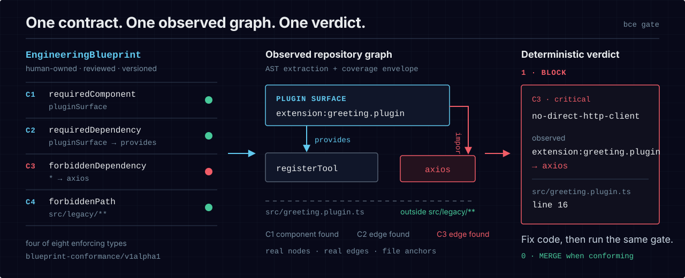

<p align="center">
  <picture>
    <source media="(max-width: 600px)" srcset="assets/bce-banner-mobile.svg">
    
  </picture>
</p>

# Architecture rules your agents cannot quietly break

`bce` is a local, deterministic merge gate for software architecture. You check a versioned
`EngineeringBlueprint` into the repository; each change must conform or return an exact reason it
cannot merge.

**Released support (`v0.2.0`):** mature TypeScript/JavaScript framework-surface AST extraction and
Python import-surface MVP. **Source candidate (`v0.3.0`):** adds direct TypeScript/JavaScript and
structured Python module boundaries. Node 22+ is required; the contract remains pre-1.0.

<!-- award-slot: reserved. Activate only in a PR that links an award actually won. -->

<p align="center">
  <a href="https://github.com/blueprint-conformance/bce/actions/workflows/self-gate.yml"></a>
  <a href="https://github.com/blueprint-conformance/bce/actions/workflows/ci.yml"></a>
  
</p>

## Run a real gate

Three commands. No account, hosted service, API key, or repository setup:

```bash
npm view bce-engine@0.2.0 version dist.integrity
npm install --save-dev --save-exact bce-engine@0.2.0
npx --no-install bce demo
```

The released demo runs one conforming tree and one drifted tree. The `v0.3.0` source candidate adds
six targeted recipes for extension registration, tenant access, egress, TypeScript and Python
module layering, and configuration widening. It is not published yet; the registry preflight below
must succeed before anyone installs or describes it as released:

```bash
npm view bce-engine@0.3.0 version dist.integrity
```

[Run the candidate recipes from source](docs/first-win.md), or stay on the immutable `v0.2.0`
release for the zero-argument proof above.

## The architecture package

One checked-in blueprint defines the intended components, relationships, and boundaries. BCE
extracts the repository it received, compares the two, and returns one deterministic verdict.

<p align="center">
  <picture>
    <source media="(max-width: 600px)" srcset="assets/bce-architecture-package-mobile.svg">
    
  </picture>
</p>

These are the specification's first four enforcing types: **C1 `requiredComponent`** requires a
real `pluginSurface`; **C2 `requiredDependency`** requires its governed registration edge;
**C3 `forbiddenDependency`** rejects the `axios` import; and **C4 `forbiddenPath`** keeps extracted
components out of `src/legacy/**`. The taxonomy has four more enforcing types and three explicit
reserved types—[open the C1–C4 visual guide](docs/constraint-guide.md) or
[read the exact semantics](spec/SPEC.md#3-constraint-taxonomy--11-types).

In `v0.2.0`, the AI-first review surface's `bce propose` writes an immutable draft
packet to quarantine; the model cannot approve or land policy. [Read the review
ceremony](docs/ai-first-review.md).

## See the gate discriminate

This excerpt is cut from a live engine run on every push. It keeps the decisive lines selectable
while the [full transcript](docs/launch/hero-demo.txt) retains every emitted detail.

<p align="center">
  
</p>

```console
$ bce gate --repo drift --blueprint-dir blueprint --extractor ast --all
::error::    - [no-direct-http-client/critical] extension:greeting.plugin
        observed: forbidden edge extension:greeting.plugin -> axios is present
        at:       src/greeting.plugin.ts#L16
bce gate [enforced]: 1/1 blueprint(s) evaluated, 1 failing.
$ echo $?
1

$ bce gate --repo clean --blueprint-dir blueprint --extractor ast
  ✓ no-direct-http-client@0.1.0 — score 100 (pass)
bce gate [enforced]: 1/1 blueprint(s) evaluated, 0 failing.
$ echo $?
0
```

CI derives those lines from real RED and GREEN runs and rejects byte drift. The
[proof contract](tests/root-readme-proof.test.ts) also verifies the complete recording and visual
replay against the engine.

## One engine, three entry points

Use the **CLI** for local feedback, the pinned **GitHub Action** at the merge boundary, or ten
read-only **MCP tools** inside an agent loop. They share the same extraction, evaluation, report,
and exit-code path; policy changes remain outside MCP. The released Action source is pinned to
`blueprint-conformance/bce@14716bf655d8dd6020b9dcf8905678ef2abe2760`.

<p align="center">
  <picture>
    <source media="(max-width: 600px)" srcset="assets/bce-agent-skill-loop-mobile.svg">
    
  </picture>
</p>

The Agent Skill loads these instructions on demand, prefers the read-only `run_gate {}` tool, fixes
source code on RED, and re-runs the same contract. [Inspect the skill](skills/README.md),
[wire the done-check](docs/agent-loop.md), or [follow ordered onboarding](docs/onboarding.md).

## Adopt without freezing the repository

<p align="center">
  <picture>
    <source media="(max-width: 600px)" srcset="assets/bce-flow-mobile.svg">
    
  </picture>
</p>

Start in advisory mode, capture known debt in a shrink-only baseline, then enforce the same verdict.
The mode is committed policy—not a skip flag—and moving backward requires a reviewed rationale.
[Read the brownfield adoption guide](docs/adopt-existing-repo.md).

## Evidence and limits

**Mechanism evidence is strong; causal product benefit is not established.** This repository has
a generated suite whose current count is shown above, replayed RED/GREEN fixtures, 47/47 killed
self-blueprint mutants, deterministic reports,
and cross-platform CI. Those are first-party proofs on author-controlled infrastructure;
[independent witnesses remain 0](ATTESTATIONS.md).

Accelerated pilot v3 completed the evaluation path but saturated both arms. V4 then safety-halted
at 6/24 after exposing an identity-comparator defect and an unqualified local agent/tool loop; its
18 remaining assignments were never run and it produced no analysis. The held-out 600-trial study
has not run. We do not yet claim that BCE makes agents more successful, cheaper, faster, or safer
than a baseline. [Check the public truth ledger](STATUS.md) or
[inspect the study contract](research/model-evaluation/README.md).

<!-- fleet-record:begin -->
<!-- Private fleet telemetry is intentionally excluded from public capability claims. -->
<!-- fleet-record:end -->

## Start with your repository

The `v0.3.0` source candidate contains six packaged architecture recipes. Run one from a checkout,
then adapt it with a measured authoring walkthrough for an empty repository, plain JavaScript,
TypeScript, a monorepo, or direct module layering: **[choose the boundary that must
hold](docs/first-win.md)**. The measured test keeps every layout's author → RED → fix → GREEN first
win in under 60 seconds, including loaded-runner contention.

Specification: [blueprint-conformance/v1alpha1](spec/SPEC.md) · Agent loop:
[MCP and agent workflow](docs/agent-loop.md) · Documentation:
[blueprint-conformance.github.io/bce](https://blueprint-conformance.github.io/bce/)

**Current registry release: v0.2.0.** Its exact npm integrity is
`sha512-hFKOHO+EYgQbp+jaOW7/WTBGEqjHDEEKfB+O1ALo8KLnmIAr708mQWeXxRUMi3YAmWxz1RhfiAY1Rdpk81NNrA==`,
and its source/Action commit is `14716bf655d8dd6020b9dcf8905678ef2abe2760`. The canonical GitHub
Release is immutable. It froze before its generated assets uploaded, so the package and tag were
left untouched and the exact signed record was preserved in a separate immutable evidence release.
[Read the verification and recovery record](docs/release-v0.2.0.md). Compatibility remains pre-1.0.

Apache-2.0 — [license](LICENSE), [notice](NOTICE), and [trademarks](TRADEMARKS.md).
