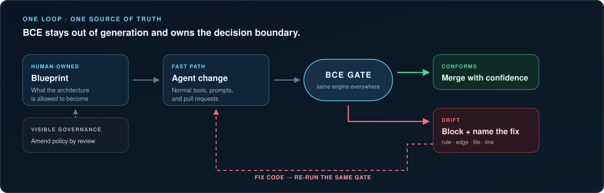

<p align="center">
  <picture>
    <source media="(max-width: 600px)" srcset="assets/bce-banner-mobile.svg">
    
  </picture>
</p>

# Architecture rules your agents cannot quietly break

`bce` is a local, deterministic merge gate for software architecture. You own a versioned
blueprint. Agents keep using their normal tools. Every change has to conform—or return an exact,
actionable reason why it cannot merge.

<!-- award-slot: RESERVED, and deliberately inert.
     A chip goes live ONLY when the thing is actually won, in a PR that links the award —
     never as a decoration that rides along with an unrelated change. The promise
     `readme/award-slots` in scripts/launch-readiness-check.mjs refuses any chip that appears
     outside this comment, so activation cannot happen by accident.
<p align="center">
  <a href="AWARD-URL"></a>
</p>
-->

<p align="center">
  <a href="https://github.com/blueprint-conformance/bce/actions/workflows/self-gate.yml"></a>
  <a href="https://github.com/blueprint-conformance/bce/actions/workflows/ci.yml"></a>
  
  
  
  =22">
  
</p>

**[Run it](#run-a-real-gate) · [See the failure](#watch-red-become-green) · [Choose a surface](#one-engine-three-ways-in) · [Adopt it](#start-advisory-end-enforced) · [Check the evidence](#evidence-boundary) · [Read the docs](#go-deeper)**

## Run a real gate

Node 22 or newer. Two commands. No account, hosted service, API key, or repository setup:

```bash
npm install --save-dev --save-exact bce-engine@0.1.5
npx --no-install bce demo
```

The packaged demo makes one conforming tree go GREEN and one drifted tree go RED. When you are
ready for your own code, **author a contract, catch a real violation, and go green on your own repo
in under 10 seconds.** The four supported starting shapes are timed in CI; that number is a
regression ceiling on local fixtures, not a performance benchmark.

[Pick your repository shape](docs/first-win.md) · [Take the five-minute path](docs/quickstart.md) · [Onboard the complete stack](docs/onboarding.md)

## The contract is simple

- **Humans own policy.** Architecture rules live in reviewed JSON beside the code.
- **Agents own changes.** BCE stays outside generation, prompts, and model choice.
- **The engine owns the verdict.** The same extraction, evaluation, report, and exit-code path runs
  locally, through MCP, and on pull requests.

Exit `0` means the command succeeded. Exit `1` means a graded violation or user error. Exit `2`
means BCE could not honestly grade the change and refused to pretend it passed. In enforced mode,
both `1` and `2` block the merge. [Read the exact exit-code contract](docs/exit-codes.md).

## Watch RED become GREEN

This is a replay of the actual engine: one forbidden import, its rule, observed edge, file, line,
repair paths, and final process exit.

<p align="center">
  
</p>

### Copy the verified transcript

```console
$ bce gate --repo drift --blueprint-dir blueprint --extractor ast --all
::error::blueprint no-direct-http-client@0.1.0 FAILED — score 60: 1 NEW violation(s). 1 constraint(s) evaluated; 1 violation(s); score 60
::error::  no-direct-http-client (critical): 1 violation(s)
::error::    - [no-direct-http-client/critical] extension:greeting.plugin
        observed: forbidden edge extension:greeting.plugin -> axios is present
        expected: no axios edge
        at:       src/greeting.plugin.ts#L16
      fix: change the code to satisfy 'no-direct-http-client'  |  amend: if the rule is wrong, edit/remove 'no-direct-http-client' in the blueprint via PR
bce gate [enforced]: 1/1 blueprint(s) evaluated, 1 failing.
$ echo $?
1

$ bce gate --repo clean --blueprint-dir blueprint --extractor ast
  ✓ no-direct-http-client@0.1.0 — score 100 (pass)
bce gate [enforced]: 1/1 blueprint(s) evaluated, 0 failing.
$ echo $?
0
```

The two runs are re-executed on every push. CI compares the transcript and animation byte for byte
with live engine output, so the front page cannot quietly become a staged demo.
[Inspect the proof](tests/root-readme-proof.test.ts) · [Regenerate the recording](scripts/hero-demo-record.mjs)

## One engine. Three ways in.

| Surface | Use it when | What you get |
|---|---|---|
| **CLI** | You want local feedback or CI outside GitHub. | Author, validate, scan, prove teeth, and gate from a terminal or script. |
| **GitHub Action** | Conformance must be a required pull-request check. | A deterministic verdict and visible policy history at the merge boundary. |
| **MCP + Agent Skills** | An agent should diagnose and correct drift in its own loop. | Six typed, read-only tools; policy changes remain outside MCP. |

These are adapters, not separate implementations. They consume the same engine, blueprint, report
contract, and exit codes.

## Start advisory. End enforced.

Brownfield repositories need a ratchet, not an unreviewed wall of red.

<p align="center">
  <picture>
    <source media="(max-width: 600px)" srcset="assets/bce-flow-mobile.svg">
    
  </picture>
</p>

1. **Advisory** reports every violation while the team learns the boundary.
2. **Shrink-only baseline** records known debt; new violations block and old debt can only fall.
3. **Enforced** makes the same verdict a required merge decision.

The mode is committed policy, not a convenient CLI flag. A downgrade requires a recorded rationale.
[Adopt BCE on a living repository](docs/adopt-existing-repo.md).

## Put it on every pull request

`bce onboard` generates the full workflow plus agent context, project skills, and project-local MCP
configuration. The core Action wiring stays deliberately small:

```yaml
# .github/workflows/blueprint-conformance.yml
name: blueprint conformance
on: [pull_request]
jobs:
  gate:
    runs-on: ubuntu-latest
    steps:
      - uses: actions/checkout@11d5960a326750d5838078e36cf38b85af677262 # v4
        with: { fetch-depth: 0 }
      - uses: blueprint-conformance/bce@3611709acf0dace4698dd1876f835a73ec44837b
        with:
          repo: .
          engine: bce-engine@0.1.5
```

Both executable surfaces are exact pins. The comment may be readable; the SHA and package version
are what run. [Follow the ordered onboarding path](docs/onboarding.md).

## Evidence boundary

> **BCE has strong mechanism evidence. Its causal benefit to agent teams is not yet established.**

| Verified here | Not established |
|---|---|
| 788 tests, replayed RED/GREEN fixtures, and 38/38 self-blueprint mutants killed through the production path. | Completeness against every possible architectural defect. |
| Self-gating, clean-consumer installs, deterministic reports, restricted-network operation, and Ubuntu/macOS/Windows × Node 22/24 CI. | Independent confirmation merely because author-controlled automation is green. |
| A sealed eight-attempt model-evaluation pilot that replays exactly. Both arms scored 4/4 on its easy tasks. | That BCE makes agents more successful, cheaper, faster, or safer than a baseline. |

The held-out, provider-identified 240-trial confirmatory study has not run. The accelerated pilot
saturated, observed no skill reads, no MCP calls, one model-initiated BCE gate call, and no
trustworthy cost data. It proves the evaluation machinery works; it does not estimate product
uplift. [Read the pilot](research/model-evaluation/pilots/accelerated-v3/RESULTS.md) · [Inspect the study contract](research/model-evaluation/README.md) · [Check every public claim](STATUS.md)

<!-- fleet-record:begin -->
<!-- Private fleet telemetry is intentionally excluded from public capability claims. -->
<!-- fleet-record:end -->

## Credibility

All repository proofs are first-party evidence: they run on infrastructure the authors control,
from code the authors wrote. That is useful and reproducible. It is not independent validation.

- **Independent witnesses: 0.** [ATTESTATIONS.md](ATTESTATIONS.md) records that number plainly. The
  [one-minute witness kit](docs/launch/witness-kit.md) records contradictions too.
- **External execution exists, but remains creator-maintained.** The public
  [Action witness repository](https://github.com/blueprint-conformance/bce-action-witness) shows
  GREEN, planted drift blocking, and GREEN after correction across a repository boundary.
- **Citation metadata is software-only.** [CITATION.cff](CITATION.cff) invents no paper, DOI, or
  arXiv record.

If BCE is useful in your repository, star it. That is one signal its authors cannot manufacture.

## Go deeper

| Goal | Start here |
|---|---|
| Build your first blueprint | [First win](docs/first-win.md) · [Quickstart](docs/quickstart.md) · [Onboarding](docs/onboarding.md) |
| Understand the contract | [Specification](spec/SPEC.md) · [JSON Schemas](spec/schemas) · [Conformance vectors](spec/conformance-vectors) |
| Put BCE inside an agent loop | [Agent loop](docs/agent-loop.md) · [MCP compatibility](docs/mcp-compatibility.md) · [Agent Skills](skills/README.md) |
| Verify the evidence | [Evidence format](docs/evidence-format.md) · [Report contract](docs/report-contract.md) · [Exit codes](docs/exit-codes.md) |
| Compare or contribute | [Comparison](docs/comparison.md) · [Roadmap](ROADMAP.md) · [Contributing](CONTRIBUTING.md) · [Security](SECURITY.md) |

Docs site: <https://blueprint-conformance.github.io/bce/>

**Status: v0.1.5 released.** The npm package has provenance and the release evidence is verified.
Its historical tag is mutable; repository-level release immutability now protects future releases,
so executable examples pin the v0.1.5 source commit. The schema remains
`blueprint-conformance/v1alpha1` and compatibility remains pre-1.0.

## License

Apache-2.0 — see [LICENSE](LICENSE), [NOTICE](NOTICE), and [TRADEMARKS.md](TRADEMARKS.md).
