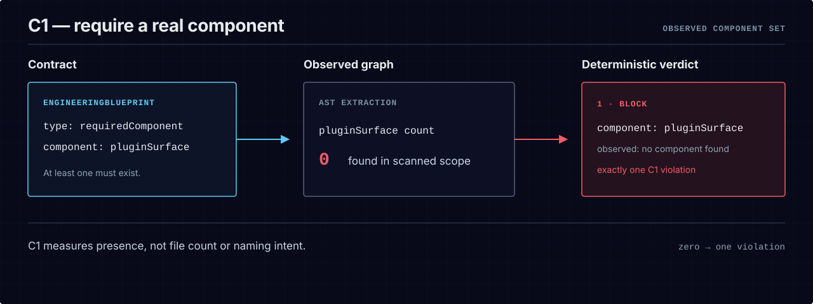
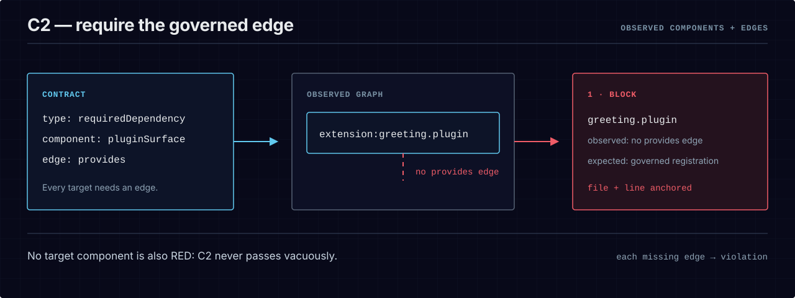
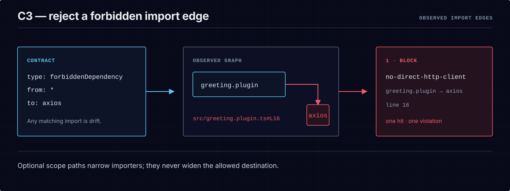
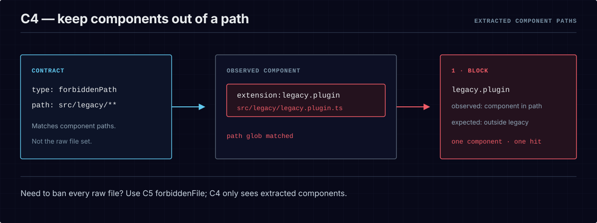

# Visual guide to C1–C4

The first four enforcing constraint types answer four different questions about the observed
architecture graph: does a component exist, does it use the governed edge, does a prohibited import
exist, and does an extracted component live under a prohibited path? This is a visual reading aid;
the [constraint taxonomy in the specification](../spec/SPEC.md#3-constraint-taxonomy--11-types) is
normative.

The module-graph notes on C2 and C3 describe the unpublished `v0.3.0` source candidate. The current
`bce-engine@0.2.0` registry release supports the framework-specific semantics shown in the diagrams,
not `typescript-module-graph` or `python-module-graph`.

| Constraint | Question BCE answers | Evidence graded |
|---|---|---|
| C1 `requiredComponent` | Does at least one component of this type exist? | observed component set |
| C2 `requiredDependency` | Does every target component have the governed outgoing edge? | observed components and edges |
| C3 `forbiddenDependency` | Does any matching importer point to the prohibited module? | observed import edges |
| C4 `forbiddenPath` | Does an extracted component path match the prohibited glob? | extracted component paths |

## C1 — `requiredComponent`

  <picture>
    <source media="(max-width: 600px)" srcset="../assets/diagrams/c1-required-component-mobile.svg">
    
  </picture>

C1 is a presence assertion over component *types*. It does not count source files or accept a
filename as proof. The selected extractor must recognize at least one component of the named type;
zero observed components produces one violation.

## C2 — `requiredDependency`

  <picture>
    <source media="(max-width: 600px)" srcset="../assets/diagrams/c2-required-dependency-mobile.svg">
    
  </picture>

C2 is universal over the target component set: every matching component needs a satisfying outgoing
edge. A missing edge produces a violation anchored to that component. An empty target set also
produces a violation, because “nothing existed to check” cannot prove a governed registration path.

Under `typescript-module-graph` and `python-module-graph`, C2 uses `scopePaths` for importer modules
and a `to` selector for the required direct target. The component is `typescriptModule` or
`pythonModule`, respectively. A matching source with no such edge fails; unresolved imports cannot
be used as proof of the required edge.

## C3 — `forbiddenDependency`

  <picture>
    <source media="(max-width: 600px)" srcset="../assets/diagrams/c3-forbidden-dependency-mobile.svg">
    
  </picture>

C3 inspects real import edges. `from` may name one component or use `*` for any importer; optional
`scopePaths` narrow which importer files count. Every matching edge to `to` is a separate violation,
including an import from a file the extractor could not attribute to a recognized component.

Under both module-graph profiles, C3 filters only `imports` edges, uses `scopePaths` for importer
modules, and requires `from` to be absent or `*`. Both accept `module:` and `package:` targets;
TypeScript also accepts `builtin:`. An unresolved import inside the source scope fails closed
because BCE cannot prove that it avoids the forbidden target. See the
[TypeScript](typescript-module-graph.md) and [Python](python-module-graph.md) module-graph guides.

## C4 — `forbiddenPath`

  <picture>
    <source media="(max-width: 600px)" srcset="../assets/diagrams/c4-forbidden-path-mobile.svg">
    
  </picture>

C4 compares paths attached to *extracted components* with the declared glob. That distinction is
deliberate: to reject every scanned file under a path even when it produces no component, use C5
`forbiddenFile`.

## Read a result

All four constraints flow through the same evaluator and report contract. A graded violation exits
`1` in enforced mode; an inability to grade honestly exits `2`. The report names the constraint,
severity, component, observed fact, expected fact, and a file-and-line evidence reference where the
extractor can provide one.

## Recommended next step

- [`quickstart.md`](quickstart.md) — run the same source-to-verdict path locally.
- [`report-contract.md`](report-contract.md) — inspect the deterministic result shape.
- [`exit-codes.md`](exit-codes.md) — distinguish a graded violation from a fail-closed refusal.
