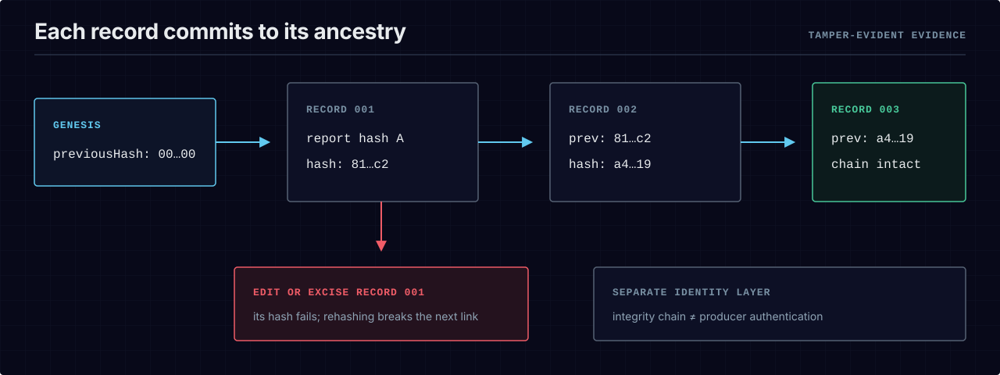

# The bce evidence format — hash-chained, re-derivable, tamper-evident

`bce run --emit` turns every conformance run into one immutable **EvidenceRecord**
— a link in an append-only, tamper-evident hash chain. A sequence of runs over a
subsystem becomes a ledger a reviewer can verify **with node alone**
(`tools/verify-chain.mjs`, zero dependencies), and re-derive **byte-for-byte**
from the run's inputs. This document is the format contract.

Machine-readable schema: `spec/schemas/evidence-record.schema.json`
(`$id`: `https://blueprint-conformance.github.io/bce/schemas/evidence-record.schema.json`).
Producing implementation: `src/emit.ts`. Committed worked example:
`evidence/example-chain/` (three records produced by real runs, with recorded
verify/tamper transcripts).

<p align="center">
  <picture>
    <source media="(max-width: 600px)" srcset="../assets/diagrams/evidence-hash-chain-mobile.svg">
    
  </picture>
</p>

## 1. The record

```json
{
  "schemaVersion": "1",
  "id": "evidence:<blueprintRef>:<hash[0..16]>",
  "traceId": "<blueprint id — one chain per subsystem>",
  "blueprintRef": "<blueprint id>@<version>",
  "ctRepoRevision": "<the pinned git revision the run graded>",
  "score": 0,
  "verdict": "pass | fail",
  "violationCount": 0,
  "reportEvidenceRef": "architecture-graph.json@sha256:<graph hash>",
  "toolchain": {
    "engine": { "name": "bce-engine", "version": "<exact version>" },
    "dependencyLock": { "file": "npm-shrinkwrap.json", "sha256": "<64 hex>" },
    "runtime": { "node": "<version>", "npm": "<version>", "platform": "<os>", "arch": "<architecture>" },
    "extractor": { "kind": "ast", "profile": "plugin-surface", "provider": "typescript-ts-morph", "version": "<engine version>" }
  },
  "previousHash": "<sha256 of the PREVIOUS record, or the genesis sentinel>",
  "hash": "<sha256 of THIS record's canonical body>"
}
```

- `traceId` is the chain key: one chain per blueprint (subsystem). It is derived
  from `blueprintRef` (the part before `@`).
- `reportEvidenceRef` points one level deeper: it is the SHA-256 of the
  canonical bytes of the full `architecture-graph.json` the run scored, so the
  record commits to the *observed facts*, not just the summary numbers.
- The genesis sentinel for `previousHash` is 64 zeros
  (`EVIDENCE_GENESIS_HASH` in `src/emit.ts`).
- Current CLI emissions include `toolchain`, binding the exact engine, published
  dependency-lock digest, Node/npm runtime, platform, architecture, and extractor
  provider to the record. The field is optional in the schema only so historical
  records emitted before 0.1.6 remain verifiable; absence means that identity was
  not recorded, never that it can be inferred.

## 2. Content hash: derived-field stripping

`hash` is computed over the record's **body** — the record with its two
**derived** fields stripped:

- `id` — excluded (it is derived FROM the hash: `evidence:<blueprintRef>:<hash[0..16]>`)
- `hash` — excluded (a hash cannot contain itself)

Everything else, **including `previousHash`**, is hashed:

```
hash = sha256( stableStringify({ schemaVersion, traceId, blueprintRef,
                                 ctRepoRevision, score, verdict, violationCount,
                                 reportEvidenceRef, toolchain, previousHash }) )
```

Because `previousHash` is inside the hashed body, each link commits to its whole
ancestry — editing ANY field of ANY earlier record invalidates every later hash.
The field set is **closed**: a record with extra fields does not verify (the
verifier fail-closes on unknown keys), so nothing volatile can ride along
outside the hash.

There is deliberately **no timestamp and no hostname/user field** anywhere in
the record. Current records do include the reproducibility-relevant toolchain
environment, so record hashes can differ across platforms even when the underlying
report hash is identical. Wall-clock and operator identity, where needed, belong
to signed transport/provenance rather than being guessed from a local record.

## 3. Stable serialization

The canonical bytes are produced by `stableStringify` (`src/report.ts`, mirrored
verbatim in `tools/verify-chain.mjs`):

1. object keys sorted lexicographically, recursively (arrays keep their order);
2. `JSON.stringify(…, null, 2)` — 2-space indent;
3. one trailing newline;
4. serialization of a cyclic value is a hard error.

Two records with equal contents therefore have byte-identical canonical forms,
independent of key insertion order — which is what makes the hash meaningful.
For a fixed report, previous hash, and toolchain identity, the evidence record is
byte-identical.

## 4. Re-derivation contract

Evidence is only evidence if an outsider can re-derive it. Two levels:

**Level 1 — verify (node alone, no build, no install):**

```bash
node tools/verify-chain.mjs evidence/example-chain    # a directory of records
node tools/verify-chain.mjs some-record.json          # a single genesis record
```

The verifier independently re-implements §2 + §3 (it imports nothing from
`src/` or `dist/`) and checks, per record: shape (closed field set), hash
re-derivation, content-derived `id`, and the `previousHash` link — starting from
the genesis sentinel. Exit 0 = chain intact; exit 1 = first broken record named
with the reason; exit 2 = usage error. Directory mode reads every `*.json` in
lexicographic filename order — the filename order IS the claimed chain order.

**Level 2 — reproduce (with the engine):** the record is a pure function of
`(ComplianceReport, previousHash)`, and the report is a pure function of
`(blueprint, repo tree @ ctRepoRevision)`. Re-running

```bash
bce run --blueprint <blueprint> --ct-repo <repo> --ref <ctRepoRevision> \
  --emit --prev-hash <previousHash> --emit-evidence-out rederived.json
```

against the same revision and declared toolchain yields a **byte-identical** record.
The report remains content-deterministic across supported environments; the outer
record intentionally identifies the environment rather than hiding it. No wall-clock
or randomness enters the pipeline
(`tests/determinism-proof.test.ts` and `tests/emit.test.ts` lock this).

### Release producer identity

The hash chain above proves integrity and ordering; by itself it does not prove who produced the
record. Release workflows additionally attach `release-evidence-record.sigstore`, a keyless Sigstore
bundle created with GitHub Actions OIDC after the release gate passes. Verify both layers:

```bash
node tools/verify-chain.mjs release-evidence-record.json
sigstore verify release-evidence-record.sigstore \
  --certificate-issuer https://token.actions.githubusercontent.com \
  --certificate-identity-uri \
  https://github.com/blueprint-conformance/bce/.github/workflows/release.yml@refs/tags/vX.Y.Z
```

Use the exact release tag in the identity URI. The issuer and workflow constraints are mandatory:
verification without them establishes that some accepted Sigstore identity signed the attestation,
not that this repository's release workflow did. Local evidence remains unsigned by default and
must not be described as authenticated producer provenance.

## 5. Redaction: whole-record exclusion, never field editing

A published chain may need to withhold sensitive runs. The ONLY sanctioned
redaction is **exclusion of whole records — never editing fields inside a
record**. An edited record no longer hash-verifies (§2), which would silently
destroy the very property the chain exists to provide; a "redacted" field is
indistinguishable from tampering, and the verifier treats it as such.

Consequences of the link structure (§2):

- The publishable unit is a **contiguous, genesis-anchored prefix** of a chain.
  Excluding a record means excluding it AND everything after it — a record whose
  `previousHash` points at a withheld record cannot be verified (deleting a
  middle record breaks the chain at the next link; see the recorded excision
  transcript in `evidence/example-chain/README.md`).
- If the sensitive run is early in a chain, publish a **separate chain**
  (fresh genesis) for the shareable era instead.
- Withheld records should be *named as withheld* (count + reason) next to the
  published chain rather than silently omitted — redaction is disclosed, not
  hidden.

Records are shipped **byte-intact or not at all**.

## 6. Evidence posture at v1 (explicit)

The v1 posture is **on-demand evidence, verified on demand**:

- **NO per-merge automation on main** — merging a PR does not append to any
  committed chain.
- **NO nightly/scheduled evidence jobs.**
- **NO badges** derived from evidence records.

This is deliberate, not an omission. A committed chain is a historical artifact
bound to the revisions it graded; automating appends from CI would create
merge-racing writers over an append-only artifact and manufacture volume without
adding trust. What v1 ships instead: the emit path (`bce run --emit
--prev-hash`), the zero-dependency verifier, a real committed example chain, and
this contract — enough for any consumer to build their own evidence pipeline on
top, at their own cadence, in their own storage. Revisiting this posture (e.g. a
gate-integrated emit) is future work and would be introduced as an opt-in,
never a silent default.

## 7. Worked example

See `evidence/example-chain/`: three records produced by real `bce run --emit`
invocations of this engine over its own self-blueprint, chained
genesis → 001 → 002 → 003, with recorded transcripts of the intact verify
(exit 0), a field-tamper refusal (exit 1), and a record-excision refusal
(exit 1). `tests/verify-chain-tool.test.ts` locks all three outcomes in CI.
