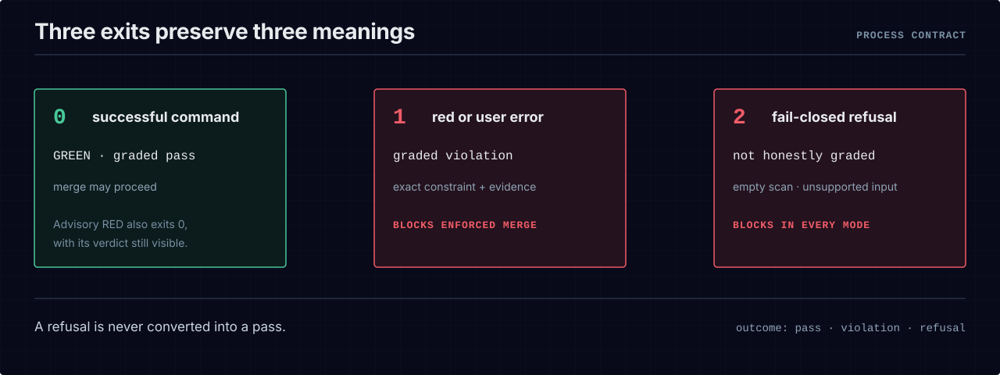

# Exit codes

`bce` speaks in process exit codes so it drops into any CI as a required check without parsing
stdout. Three codes, one meaning each:

| code | meaning |
|---|---|
| **0** | **successful command** — an enforced grade passed; an advisory grade may still report violations while intentionally remaining non-blocking. |
| **1** | **red or user error** — a graded violation, or a usage/config error. |
| **2** | **fail-closed refusal** — the run could not honestly grade (an empty scan, a malformed blueprint, an extractor that cannot honor a constraint). Deliberately distinct from a graded red: the engine is telling you it did *not* grade, rather than pretending a pass. |

  <picture>
    <source media="(max-width: 600px)" srcset="../assets/diagrams/exit-code-contract-mobile.svg">
    
  </picture>

Two consequences worth stating plainly:

- **A refusal is never a silent pass.** `2` exists precisely so that "I could not grade this" is
  never confused with "I graded this and it passed." A gate that scans zero files exits `2`, not `0`.
- **`gate` preserves the distinction.** A graded violation exits `1`; an inability to grade honestly
  exits `2`. Both block an enforced merge gate, while the machine report also records
  `outcome:"violation"` or `outcome:"refusal"` explicitly.

There is **one** designed exception to "1 = red": **advisory mode** (a committed
`.bce-mode.json`, not a flag) exits `0` on a red *verdict* by design — that is the adoption posture.
It still exits non-zero on a config, usage, or refusal condition: advisory ungates a graded
violation, never the tool's own honesty. See [`faq.md`](faq.md) for why advisory is a mode and not a
`--skip` flag.

## The authoritative table

The per-command exit-code contract — every verb, every code — is normative in the specification and
is not duplicated here to avoid drift:

**→ [`spec/SPEC.md` §13 "Exit-code contract"](../spec/SPEC.md#13-exit-code-contract-reference-cli)**

That table covers the original deterministic gate verbs. The AI-first additions follow the same
rule: `propose` and `review verify` return `0` only for a complete reviewable/verified result, usage
errors return `1`, and provider refusal, invalid output, stale inputs, failed deterministic review,
tampering, or failed SCM authentication return `2`. `review decide`, `ratify`, and `amend` return `0`
only after their exact packet and SCM bindings verify; they refuse with `2` otherwise.

## Recommended next step

- [`report-contract.md`](report-contract.md) — the machine-readable report the gate emits alongside
  the exit code.
- [`../examples/quickstart/README.md`](../examples/quickstart/README.md) — see `0` and `1` produced
  by the same blueprint over two trees, offline.
