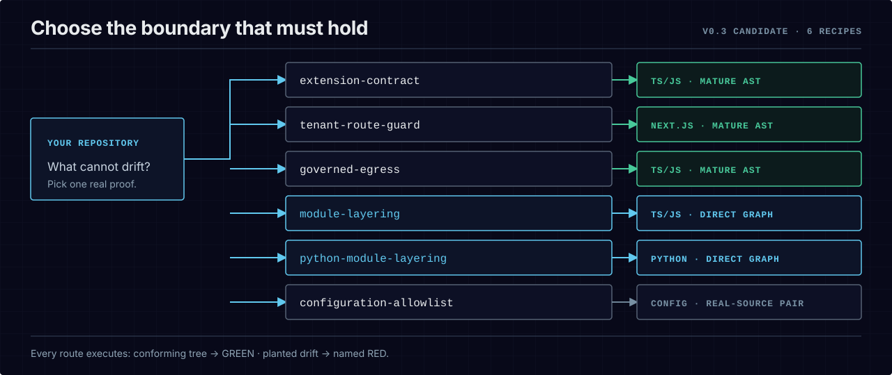

# First win — choose the boundary that must hold

Do not begin by learning the whole specification. Run the architecture failure closest to the one
you need to prevent. Each recipe ships inside `bce-engine`, stays offline, and runs one conforming
tree plus one planted drift tree through the same engine used by the merge gate.

```bash
npm view bce-engine@0.2.0 version dist.integrity
npm install --save-dev --save-exact bce-engine@0.2.0
npx --no-install bce demo --list
npx --no-install bce demo --recipe tenant-route-guard
```

The last command exits `0` only after proving both sides: the conforming tree scores 100, and the
drifted tree produces the named `d6-tenant-guard` violation. Run every recipe with
`npx --no-install bce demo --recipe all`.

The published package includes `examples/` plus the recipe fixtures. The clean-room package proof
installs the tarball outside this checkout and runs the zero-argument contract and all five recipes.

<p align="center">
  <picture>
    <source media="(max-width: 600px)" srcset="../assets/diagrams/first-win-recipes-mobile.svg">
    
  </picture>
</p>

## Pick by architectural intent

| What must not drift? | Recipe id | Evidence and maturity |
|---|---|---|
| A plugin or agent extension must exist, register through the governed helper, and avoid direct provider SDKs | `extension-contract` | TypeScript/JavaScript, mature AST; C1–C3 in one contract |
| Every exported tenant route must call the access guard | `tenant-route-guard` | Next.js TypeScript, mature AST; function-level call evidence |
| Raw network calls must stay on governed hosts | `governed-egress` | TypeScript/JavaScript, mature AST; resolved literal host evidence |
| Python modules must not import a provider SDK directly | `python-provider-import` | Python import graph MVP; imports and scanned-file rules only |
| A governed manifest must not silently widen | `configuration-allowlist` | JSON/Markdown real-source RED/GREEN pair; content-pattern teeth are evaluator-refutable |

Run one with `npx --no-install bce demo --recipe <id>`. The catalog is executable: CI runs every
listed recipe and refuses missing fixtures, a false GREEN, a false RED, or the wrong violation id.

## Adapt the proof to your layout

The packaged recipes prove what BCE can observe. These four walkthroughs show how to author a draft
against files in a repository shaped like yours:

| Starting layout | Walkthrough | What changes |
|---|---|---|
| no source files yet | [empty repository](../examples/first-win/empty-repo/README.md) | proves an empty scope refuses with exit `2` before it can claim 100 |
| CommonJS with no build step | [plain JavaScript](../examples/first-win/plain-js/README.md) | scans a real `require()` without a `tsconfig` |
| TypeScript service | [TypeScript](../examples/first-win/typescript/README.md) | authors a content constraint for parameterized SQL |
| several workspace packages | [monorepo](../examples/first-win/monorepo/README.md) | narrows enforcement with `--scope-paths` |

Each walkthrough executes its own documented `bce author → RED → code fix → GREEN` sequence in CI.
The current wall-clock budget is 120 seconds per layout. The authored blueprint begins as `draft`;
running a recipe or authoring a draft never approves policy.

## The honest support boundary

- TypeScript/JavaScript AST extraction is the mature path: Next.js route handlers, plugin surfaces,
  imports, literal egress, paths, files, and line content.
- Python is an import-graph MVP. It does not yet claim TypeScript-level component, call, or egress
  semantics.
- Content patterns can protect configuration and policy files, but BCE labels their teeth
  `evaluator-refutable`; the paired real-source mutation supplies the stronger practical proof.
- None of these mechanism demonstrations establishes that BCE improves agent success, cost,
  latency, or safety. The confirmatory efficacy study remains unrun.

## Put one boundary in your repository

After a recipe matches your intent, author the smallest draft that expresses it and install the
gate in advisory mode. Existing violations remain visible; policy approval stays human-owned.

- [Ordered onboarding](onboarding.md) — draft, review, install, and ratify one boundary.
- [Brownfield adoption](adopt-existing-repo.md) — expose debt now and tighten without a day-one wall
  of red.
- [Constraint guide](constraint-guide.md) — see the exact C1–C4 graph semantics before adapting a
  recipe.
