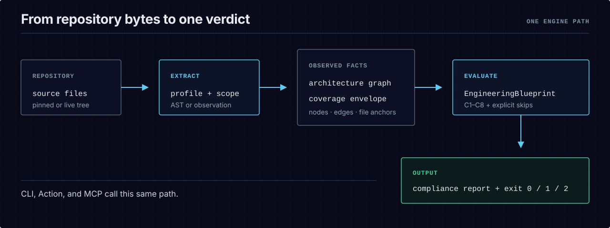

# Quickstart

The guaranteed path to seeing bce work is the offline RED→fix→GREEN walkthrough that ships in this
repository. It runs entirely offline (no API keys, no network beyond one `npm install`), on a tiny
two-tree example, and ends in a real gate failure you fix and re-run to green.

**→ [`examples/quickstart/README.md`](../examples/quickstart/README.md)** — the full walkthrough,
with the example trees checked in beside it.

This page is the one-screen version. The example is one contract and two trees that differ by a single
line:

<p align="center">
  <picture>
    <source media="(max-width: 600px)" srcset="../assets/diagrams/source-to-verdict-mobile.svg">
    
  </picture>
</p>

CLI, GitHub Action, and MCP are entry points into this same engine path. The
[C1–C4 visual guide](constraint-guide.md) shows how the first four constraint types interrogate the
observed graph.

```
examples/quickstart/
├── blueprint/no-direct-http-client.blueprint.json   # the contract
├── clean/src/greeting.plugin.ts                     # routes network through the host  → PASS
└── drift/src/greeting.plugin.ts                     # imports axios directly            → RED
```

```bash
mkdir bce-quickstart && cd bce-quickstart
npm init -y
npm view bce-engine@0.2.0 version dist.integrity
npm install --save-dev --save-exact bce-engine@0.2.0
cp -R node_modules/bce-engine/examples/quickstart .
cd quickstart
alias bce='../node_modules/.bin/bce'

# 1. the contract parses and is not vacuous
bce validate --blueprint blueprint/no-direct-http-client.blueprint.json
bce teeth --blueprint blueprint/no-direct-http-client.blueprint.json --ct-repo clean --no-pin --extractor ast

# 2. the clean tree passes (exit 0)
bce gate --repo clean --blueprint-dir blueprint --extractor ast

# 3. the drifted tree fails, naming the exact line (exit 1)
bce gate --repo drift --blueprint-dir blueprint --extractor ast --all

# 4. fix drift/src/greeting.plugin.ts to match clean/, re-gate → exit 0
bce gate --repo drift --blueprint-dir blueprint --extractor ast
```

The exact package above is the provenance-backed public release recorded in
[`STATUS.md`](../STATUS.md). The copy keeps the shipped example writable while the installed
package remains untouched.

A gate that cannot go red is not a gate. This walkthrough proves, on your own machine, that this one
can — and that a green verdict therefore means something.

## Then

- **Choose the boundary that must hold** — [`first-win.md`](first-win.md) runs five packaged
  architecture recipes across extension, route, egress, Python, and configuration surfaces, then
  links four measured layout walkthroughs where you author the contract yourself.
- **Gate your own repository** — [`adopt-existing-repo.md`](adopt-existing-repo.md) is the honest
  brownfield path: advisory → baseline → graduate → enforced.
- **Run bce inside an agent loop** — [`agent-loop.md`](agent-loop.md) wires the gate into Claude Code,
  Cursor, or any MCP client as the done-check.
- **Understand the adoption levers** — advisory mode and shrink-only baselines — in
  [`faq.md`](faq.md).
- **Wire the complete stack** — exact commit install, contract, agent context, MCP, immutable CI,
  lifecycle, and evidence — in [`onboarding.md`](onboarding.md).

## Recommended next step

- [`adopt-existing-repo.md`](adopt-existing-repo.md) — turn the gate on a repo that already drifts,
  without a day-one wall of red.
