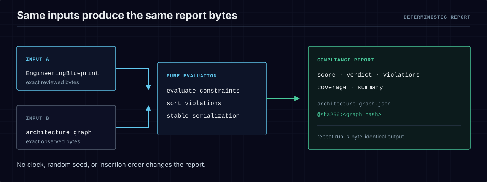

# The report contract

Every graded run produces a **compliance report**: a deterministic JSON document that says what was
measured, what the verdict was, and — for a red — exactly which contract failed, where, and why. The
report is what makes a verdict *re-derivable* rather than a claim you have to trust.

  <picture>
    <source media="(max-width: 600px)" srcset="../assets/diagrams/deterministic-report-mobile.svg">
    
  </picture>

## What a report carries

A compliance report always carries: `schemaVersion`, `blueprintRef` (`<id>@<version>`),
`ctRepoRevision`, `score`, `verdict`, `violations`, `evidenceRef`, `summary`, and `coverage`
(the extractor used, how many files it scanned, and the list of anything it could not support). It
may additionally carry an omit-not-empty `repo` identity stamp.

Each entry in `violations` names: `constraintId`, `severity`, `component`, `evidenceType`,
`evidenceRef` (a `path#L<line>` anchor where one applies), `observed`, and `expected` — the fact the
engine saw and the expectation it broke, both stated concretely, never as a bare "failed."

## Determinism — same input, byte-identical output

The report is deterministic by construction, and the determinism is *checkable*:

- Canonical serialization: object keys sorted recursively, two-space indentation, one trailing
  newline.
- Violations sorted by `(constraintId, component)`.
- `evidenceRef` is a content-addressed pointer to the exact observed-graph bytes the report was
  graded against (`architecture-graph.json@sha256:<hex>`). A fail-closed report that never scanned
  uses the explicit marker `n/a`.

Same `(blueprint, graph)` in produces the same report bytes out. That is what lets an evidence record
chain over a report and lets anyone re-derive a verdict offline.

## The authoritative definition

The report contract, its schema, and the evidence/remediation contracts that build on it are
normative in the specification and are not duplicated here to avoid drift:

- **See [`spec/SPEC.md` §11 "The report contract"](../spec/SPEC.md#11-the-report-contract)**
- **See [`spec/SPEC.md` §12 "Evidence and remediation contract"](../spec/SPEC.md#12-evidence-and-remediation-contract)** — the hash-chain and propose-not-apply work orders.
- **See [`spec/schemas/compliance-report.schema.json`](../spec/schemas/compliance-report.schema.json)** — the published JSON Schema (draft-07). Read tolerantly across engine versions (ignore unknown fields) per §10.2.

The full evidence-record format, with a worked chain and the zero-dependency verifier, is in
[`evidence-format.md`](evidence-format.md).

## The machine island in CI

The shipped GitHub Action emits the same report as a machine-parseable JSON island in its PR comment,
so a downstream tool can read the verdict without scraping human text. The island's shape is the
report above; its stability is proven by `tests/gate-report-json.test.ts`.

## Recommended next step

- [`exit-codes.md`](exit-codes.md) — the process-exit signal that rides alongside the report.
- [`evidence-format.md`](evidence-format.md) — the hash-chained record derived from a report.
- [`../examples/quickstart/README.md`](../examples/quickstart/README.md) — a real report produced
  offline, red then green.
